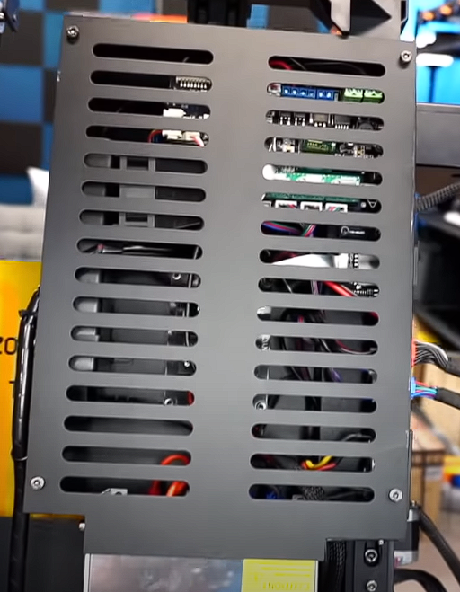
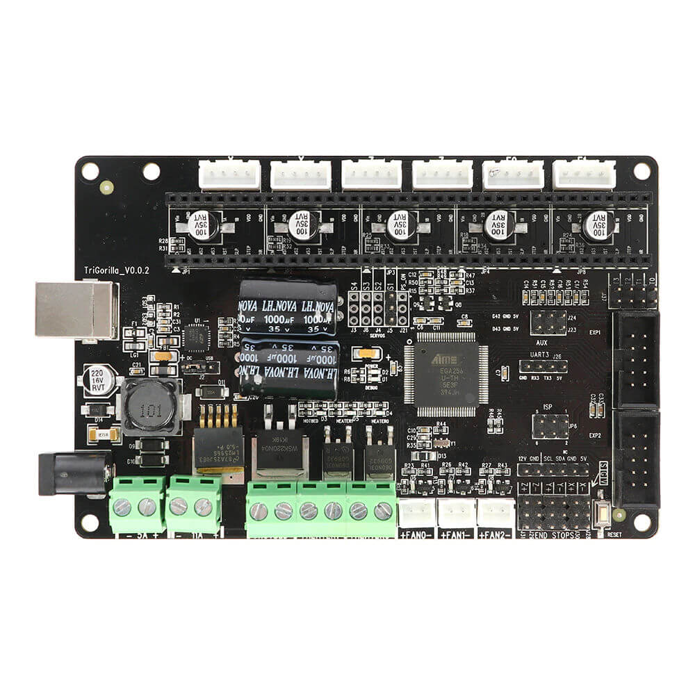

READ CLOSELY This isn’t a hard process but it does require attention to detail!

**(NOTE: This is for a Trigorilla V 0.0.2 board, make sure you have this board beforehand.)**

I assume you know how to take apart your Chiron, but in case you don’t do as follows

-   Unplug it, slide the gantry all the way to the left and place it on its left side.
-   
-   Unscrew all the screws from the underside of the Chiron seen below
-   Locate the jumper next to the USB port and move it the side that says USB, also check to see if your board says V 0.0.2. If not, I cannot guarantee this will work for you.
-   
