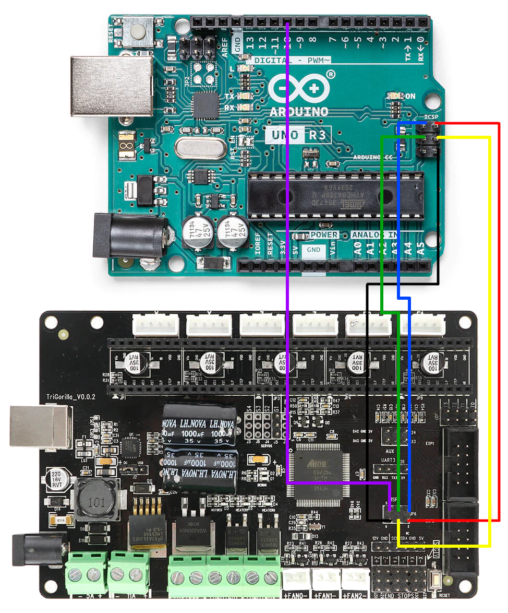
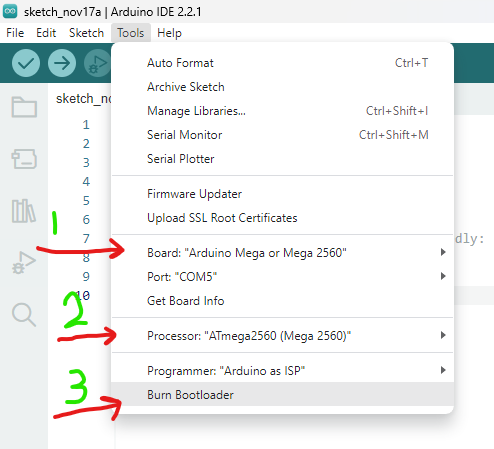

# **READ CLOSELY** This isn’t a hard process but it does require attention to detail!
#### (NOTE: This is for a Trigorilla V 0.0.2 board, make sure you have this board beforehand.) ####
-------

I assume you know how to take apart your Chiron, but in case you don’t do as follows

- Unplug it, slide the gantry all the way to the left and place it on its left side.
- Unscrew all the screws from the underside of the Chiron seen below

##### (Original image taken from TH3D (too lazy to take mine apart…. Again.)

- Locate the jumper next to the USB port and move it the side that says USB, also check to see if your board says V 0.0.2.  If not, I cannot guarantee this will work for you.
- A break out board will be above the ICSP (highlighted in Green)

---

## Now pull out your Arduino or whatever your favorite programer is.  We will be placing the jumper wires to install the bootloader, please make sure you hook up these wires correctly.

## We are almost done with the hardest part!

Next we need to boot up the Arduino IDE and connect the Arduino via USB.

Once inside the Arduino IDE make sure your Arduino is connected and selected.
##### (make sure to close any other programs that may be using your com ports for example cura or pronterface)
---

Then select Arduino as ISP.

Once that is done you can click the arrow next to the checkmark. If all is sucessful the command line should say  " *avrdude done. Thank you.* ".

---

Unplug the Arduino and plug it back in, now navigate back to the tools menu.  Here we will make the changes seen below.

Once the proper changes have been made press " **Burn Bootloader** ".  If no errors then ***Congrats*** you now have a boot loader on your chiron!

---
---
---

# Flashing Firmware (version 2.1.0.1)
---

### THis is the easy part, unplug your Arduino and and all the jumper cables. If you found it necessary to remove the breakout board that was placed over the ICSP place it back.  
### Make sure to leave the jumper on USB for now. 

- Plug your USB cable you used for the Arduino into the Chiron USB Port and direct your attention back to Arduino IDE
- Open up the Marlin.ino found in the repository files above, FIRMWARE>Marlin>Marlin.ino
- Once the project is loaded make sure to select the board that is populated in the Com drop down menu, and press the arrow.

## VIOLA YOU ARE DONE!! YAY

